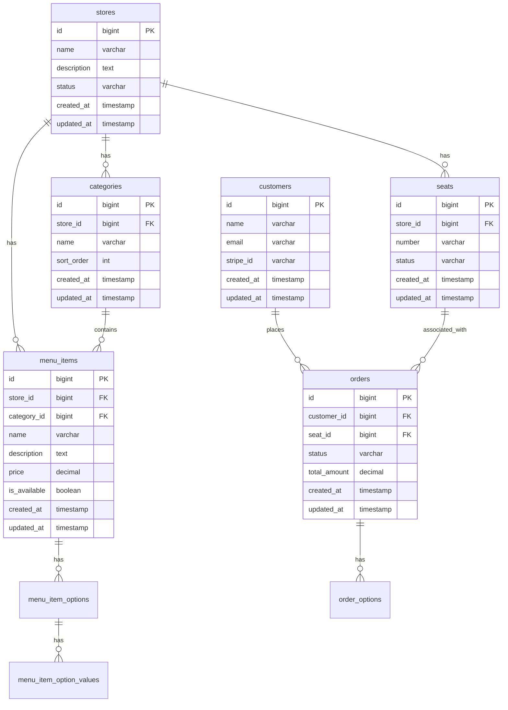

# QR Order System API

## 概要
QRコードを活用したオーダーシステムのバックエンドAPIです。ドメイン駆動設計（DDD）の考え方を取り入れ、クリーンアーキテクチャを意識した実装を行っています。

## 技術スタック
- PHP 8.2
- Laravel 10.x
- MySQL 8.0
- Docker
- GitHub Actions（CI/CD）
- Laravel Sanctum（認証）
- Laravel Cashier（サブスクリプション管理）
- Web Push通知

## アーキテクチャ
本プロジェクトは、ドメイン駆動設計（DDD）とクリーンアーキテクチャの原則に従って構築されています。Laravelの従来の構造ではなく、よりドメイン中心の設計を採用しています。

### レイヤー構造
```
app/
└── Layers/
    ├── Presentation/    # プレゼンテーション層
    │   └── API/        # APIエンドポイント（従来のControllerの代替）
    ├── Application/    # アプリケーション層（ユースケース）
    ├── Domain/         # ドメイン層
    │   ├── Entity/    # エンティティ
    │   │   ├── Shop/     # 店舗関連のエンティティ
    │   │   ├── Category/ # カテゴリ関連のエンティティ
    │   │   └── Customer/ # 顧客関連のエンティティ
    │   └── ValueObject/ # 値オブジェクト
    └── Infrastructure/ # インフラストラクチャ層
```

### 主要なドメインモデル
- Store（店舗）
- MenuItem（メニュー項目）
- Order（注文）
- Customer（顧客）
- Seat（座席）
- Category（カテゴリ）
- Subscription（サブスクリプション）

## データベース設計

### ER図


## 主要な機能
- QRコードを使用した座席認証
- メニュー表示・注文機能
- リアルタイムオーダー通知（Web Push通知）
- 注文状況管理
- 売上レポート生成
- サブスクリプション管理（Stripe連携）
- マルチテナント対応（複数店舗管理）
- カテゴリ別メニュー管理
- メニューオプション管理（トッピング等）
- 座席状態管理

## セットアップ手順

### 必要条件
- Docker
- Docker Compose
- Make（オプション）

### インストール
```bash
# リポジトリのクローン
git clone https://github.com/jobpay/qr-order-api.git
cd qr-order-api

# 環境変数の設定
cp .env.example .env

# Dockerコンテナの起動
docker-compose up -d

# 依存関係のインストール
docker-compose exec app composer install

# データベースのマイグレーション
docker-compose exec app php artisan migrate

# シードデータの投入
docker-compose exec app php artisan db:seed
```

## API仕様
APIの詳細な仕様は[Swagger UI](http://localhost:8080/api/documentation)で確認できます。

## テスト
```bash
# ユニットテストの実行
docker-compose exec app php artisan test

# 特定のテストの実行
docker-compose exec app php artisan test --filter=OrderTest
```

## CI/CD
GitHub Actionsを使用して以下の自動化を実現しています：
- プルリクエスト時の自動テスト
- コードスタイルチェック（PHP_CodeSniffer）
- 静的解析（PHPStan）
- 本番環境への自動デプロイ

## 今後の展望
- [ ] 決済機能の追加
- [ ] 多言語対応
- [ ] アレルギー情報の表示機能
- [ ] 顧客フィードバックシステム

## コントリビューション
プロジェクトへの貢献は大歓迎です。以下の手順で貢献できます：
1. このリポジトリをフォーク
2. 新しいブランチを作成 (`git checkout -b feature/amazing-feature`)
3. 変更をコミット (`git commit -m 'Add some amazing feature'`)
4. ブランチにプッシュ (`git push origin feature/amazing-feature`)
5. プルリクエストを作成

## ライセンス
[MIT License](LICENSE)

## 作者
- [jobpay](https://github.com/jobpay)
