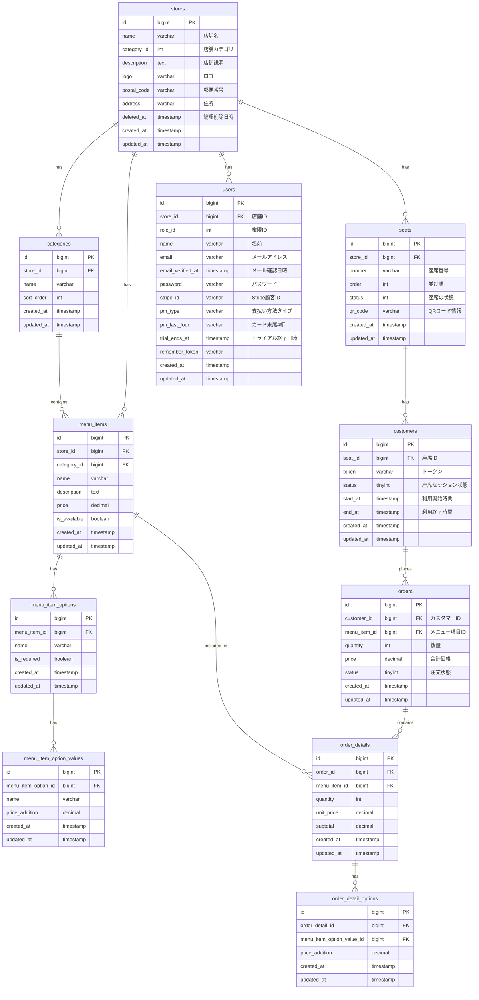

# QRコード対応 モバイルオーダーシステム API

## 概要
QRコードを活用したオーダーシステムのバックエンドAPIです。ドメイン駆動設計（DDD）およびクリーンアーキテクチャの原則を参考に構築されています。完全なクリーンアーキテクチャを厳密に実現しているわけではなく、実装の一部には妥協や独自の解釈も含まれています。Laravelの従来の構造ではなく、ドメイン中心の設計を採用しています。

## 技術スタック

- PHP 8.2
- Laravel 10.x
- MySQL 8.0
- Docker
- GitHub Actions（CI/CD）
- Laravel Sanctum（認証）
- Laravel Cashier（サブスクリプション管理）
- Web Push通知

## アーキテクチャ

本プロジェクトは、ドメイン駆動設計（DDD）およびクリーンアーキテクチャの原則を参考に構築されています。完全なクリーンアーキテクチャを厳密に実現しているわけではなく、実装の一部には妥協や独自の解釈も含まれています。Laravelの従来の構造ではなく、ドメイン中心の設計を採用しています。

### レイヤー構造
```
app/
└── Layers/
    ├── Presentation/          # プレゼンテーション層
    │   ├── Controllers/       # コントローラー
    │   │   ├── Shop/         # 店舗管理側のコントローラー
    │   │   │   ├── ShopController.php
    │   │   │   ├── MenuItemController.php
    │   │   │   └── OrderController.php
    │   │   └── Customer/     # 顧客側のコントローラー
    │   │       ├── OrderController.php
    │   │       └── MenuItemController.php
    │   └── Requests/         # フォームリクエストバリデーション
    │       ├── Shop/
    │       └── Customer/
    ├── Application/          # アプリケーション層
    │   └── UseCase/          # ユースケース（アプリケーションサービス）
    │       ├── Shop/         # 店舗管理側のユースケース
    │       │   ├── Shop/
    │       │   │   ├── StoreUseCase.php
    │       │   │   └── ShowUseCase.php
    │       │   └── MenuItem/
    │       └── Customer/
    ├── Domain/               # ドメイン層
    │   ├── Entity/          # エンティティ
    │   │   ├── Shop/        # 店舗関連のエンティティ
    │   │   ├── Category/    # カテゴリ関連のエンティティ
    │   │   └── Customer/    # 顧客関連のエンティティ
    │   └── ValueObject/     # 値オブジェクト
    └── Infrastructure/      # インフラストラクチャ層
        ├── Repository/      # リポジトリ実装
        │   ├── StoreRepository.php
        │   ├── MenuItemRepository.php
        │   └── OrderRepository.php
        └── Service/         # 外部サービス連携
```

### 主要なドメインモデル
- Store（店舗）
- MenuItem（メニュー項目）
- Order（注文）
- Customer（顧客）
- Seat（座席）
- Category（カテゴリ）
- Subscription（サブスクリプション）

## データベース設計

### ER図


## 主要な機能

- QRコードを使用した座席認証
- メニュー表示・注文機能
- リアルタイムオーダー通知（Web Push通知）
- 注文状況管理
- 売上レポート生成
- サブスクリプション管理（Stripe連携）
- マルチテナント対応（複数店舗管理）
- カテゴリ別メニュー管理
- メニューオプション管理（トッピング等）
- 座席状態管理

## API仕様

## テスト

## CI/CD

## 今後の展望

- [ ] 決済機能の追加
- [ ] 多言語対応
- [ ] API仕様
- [ ] テスト実装
- [ ] プルリクエスト時の自動テスト
- [ ] コードスタイルチェック（PHP_CodeSniffer）
- [ ] 静的解析（PHPStan）
